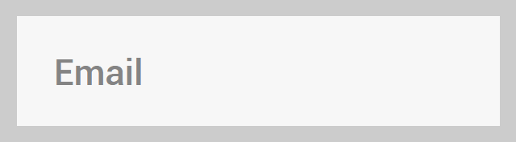

# hello-react-hook-form
## [Live preview](https://jota11.github.io/hello-react-hook-form)

Just playing around with React Hook Form. Using React Router for the pages.
 
You can see the input data being handled by opening the developer console.
Always handle your data on the backend too. Thanks.

---
## ✨ Effects made with pure (S)CSS ✨

